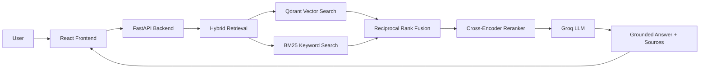
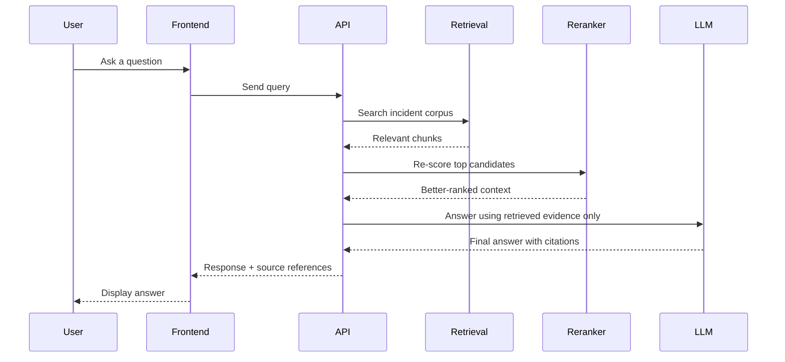

# Cloudflare Incident RAG

A friendly, full-stack Retrieval-Augmented Generation project that answers questions about Cloudflare incident reports using original public postmortems as the source of truth.

Instead of guessing, the system is designed to answer only from the retrieved context and clearly say when the information is not in the dataset.

## Why this project matters

This project combines:

- a React frontend for a clean user experience
- a FastAPI backend for query handling and orchestration
- Qdrant for vector search
- hybrid retrieval for better factual precision
- a reranker to improve result quality
- an LLM to generate grounded answers with citations

The goal is simple: help users ask factual questions like “How long did the January 2026 route leak incident last?” and get answers anchored in the actual incident documentation.

## System overview



## How the pipeline works



## Project pipeline

1. Data ingestion
   - Collects public Cloudflare incident postmortems
   - Saves cleaned markdown documents with metadata

2. Recursive chunking
   - Splits content by section headings first
   - Further splits long sections into smaller chunks
   - Preserves title, URL, and section context

3. Embedding generation
   - Uses BAAI/bge-m3 embeddings for semantic retrieval

4. Vector storage
   - Stores chunk embeddings in Qdrant
   - Enables similarity-based retrieval

5. Hybrid retrieval
   - Combines vector search and BM25 keyword search
   - Fuses them using Reciprocal Rank Fusion (RRF)

6. Reranking
   - Re-scores the best matches with a cross-encoder
   - Improves precision and ordering of results

7. Answer generation
   - Uses Groq-hosted Llama 3.3
   - Answers only from the retrieved context
   - Cites claims and declines when context is missing

8. Evaluation
   - Checks factuality, relevance, and refusal quality
   - Uses Ragas and custom unanswerable-question tests

9. Deployment
   - Docker Compose orchestrates backend, frontend, and Qdrant

## Tech stack

- Frontend: React + Vite
- Backend: FastAPI + Python
- Vector database: Qdrant
- Dense embeddings: BAAI/bge-m3
- Reranker: BAAI/bge-reranker-v2-m3
- LLM: Groq (Llama 3.3 70B)
- Evaluation: Ragas
- Observability: LangSmith
- Deployment: Docker Compose

## Features

- Search across Cloudflare incident postmortems
- Hybrid retrieval using both semantic and keyword matching
- Reranking for more accurate context selection
- Grounded answers with citations to source material
- Safe refusal behavior when the answer is not in the corpus
- Docker-based local setup for easy running

## Quick start with Docker

1. Clone the repository
2. Create the environment file:

```bash
cp backend/.env.example backend/.env
```

3. Fill in your API keys and environment variables for Groq and LangSmith
4. Start the stack:

```bash
docker compose up --build
```

5. Open these in your browser after startup:

- Frontend: http://localhost:3000
- Backend docs: http://localhost:8000/docs
- Qdrant dashboard: http://localhost:6333/dashboard

## Local development

### Backend

```bash
cd backend
python -m venv venv
# Windows
.\venv\Scripts\Activate.ps1
# macOS / Linux
# source venv/bin/activate
pip install -r requirements.txt
uvicorn app:app --reload --port 8000
```

### Frontend

```bash
cd frontend
npm install
npm run dev
```

### Qdrant

```bash
docker run -d --name qdrant-rag -p 6333:6333 -p 6334:6334 -v "${PWD}/qdrant_storage:/qdrant/storage" qdrant/qdrant
```

## Regenerate the pipeline from scratch

If the data folder is not yet populated, run the following from inside the backend directory:

```bash
python ingest_cloudflare_incidents.py
python fix_markdown_headings.py
python chunk_documents_llamaindex.py
python generate_embeddings.py
python upload_to_qdrant.py
```

After that, you can run the API with:

```bash
uvicorn app:app --reload --port 8000
```

## Project structure

```text
Rag_Cloudflare/
├── backend/
│   ├── app.py
│   ├── generate_answer.py
│   ├── hybrid_retrieval.py
│   ├── reranking.py
│   ├── ingest_cloudflare_incidents.py
│   ├── chunk_documents_llamaindex.py
│   ├── generate_embeddings.py
│   ├── upload_to_qdrant.py
│   ├── data/
│   │   ├── raw/
│   │   ├── chunks/
│   │   ├── embeddings/
│   │   └── eval/
│   └── requirements.txt
├── frontend/
│   ├── src/
│   ├── public/
│   ├── package.json
│   └── vite.config.js
├── qdrant_storage/
├── docker-compose.yml
├── Dockerfile.backend
├── Dockerfile.frontend
├── README.md
└── .gitignore
```

## Evaluation results

The project was evaluated on a manually reviewed set of factual questions and a separate set of deliberately unanswerable questions.

### Refusal accuracy

- 5 out of 5 unanswerable questions were correctly refused
- This helps reduce hallucinations when the corpus does not contain the needed fact

### Ragas metrics

| Metric | Status |
|---|---|
| Faithfulness | pending final run |
| Answer Relevancy | pending final run |
| Context Precision | pending final run |
| Context Recall | pending final run |
| Answer Correctness | pending final run |

Full results are available in `backend/data/eval/ragas_results.csv`.

## Design decisions

### Hybrid retrieval instead of pure vector search

Dense retrieval is powerful, but it can blur exact numbers, dates, and names. BM25 gives the system a strong fallback for exact matching and improves reliability on factual questions.

### Reranking as a quality correction step

The first retrieval stage is fast but not always perfect. The reranker rechecks the top candidates with the query and each chunk together, which improves ordering and factual precision.

### Refuse to speculate

This system is intentionally strict: if the evidence is missing, it says so instead of inventing an answer. That is a major strength for a production-grade knowledge assistant.

### CPU-friendly deployment

The project is containerized to run efficiently on CPU-based environments, making local and portfolio deployment easier without requiring GPU setup.

## Example questions

- How long did the January 2026 route leak incident last?
- What caused the DNSSEC-related outage?
- Which incidents involved cache issues or worker failures?
- Which postmortems mention mitigation or rollback strategies?

## Notes

This project is built as a portfolio-ready RAG system and is meant to show how a modern retrieval pipeline can be designed, evaluated, and deployed in a realistic application.

If you want, I can also prepare a second version of the README tailored specifically for GitHub showcase style, portfolio style, or enterprise documentation style.
